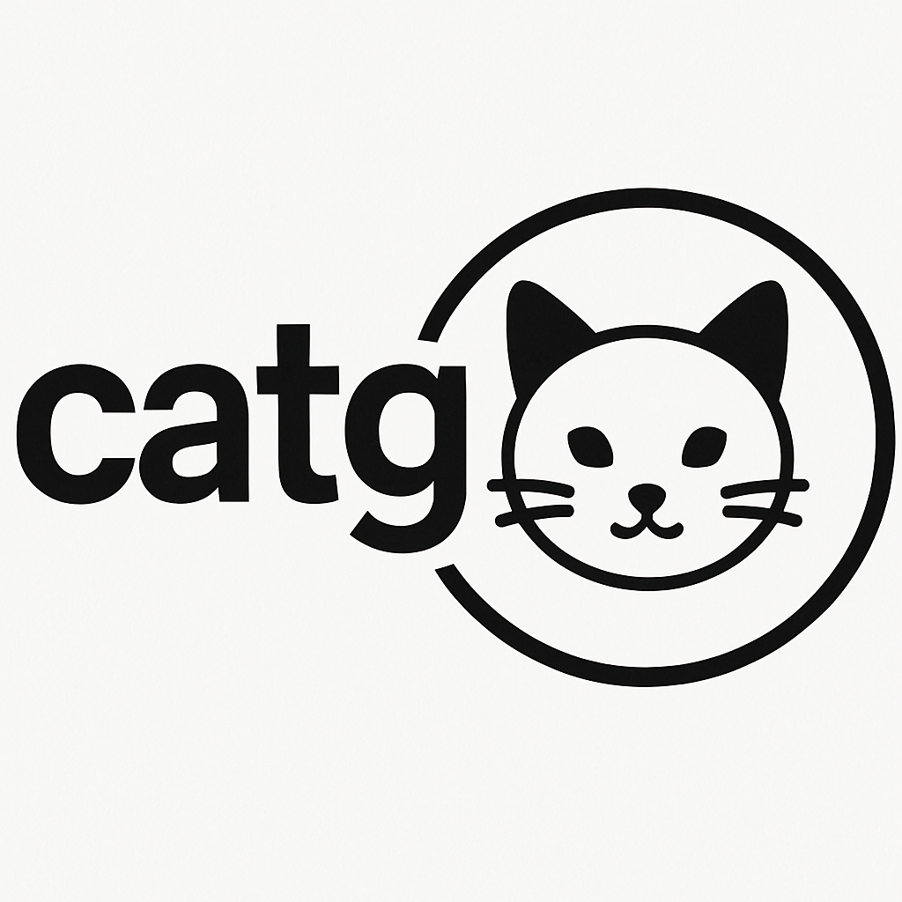

---

# catg: A Toy Programming Language Interpreter



**catg** is a simple programming language interpreter written in Python.
I built this as a learning project to better understand how interpreters work and how to design a mini-language from scratch.

---

## Features

* Variable declarations and assignments (`make x = 5`)
* Arithmetic operations (`+`, `-`, `*`, `/`)
* Comparison operators (`>`, `>=`, `<`, `<=`, `?=`)
* Boolean operators (`and`, `or`, `not`)
* Control flow:

  * `if`, `elif`, `else`
  * `while` loops
* Interactive REPL so you can enter and run code live

---

## Example Program

```catg
make x = 5 + 2
if x > 3 do make x = x * 2 else do make x = 0
while x > 0 do make x = x - 1
```

This creates a variable `x`, conditionally modifies it, and then decrements it in a loop until it reaches zero.

---

## How catg Works

catg has four main parts:

### 1. Lexer

The lexer reads the source code and splits it into tokens (for example, turning `make x = 5 + 2` into `DECL('make') VAR('x') OP('=') INT('5') OP('+') INT('2')`).

### 2. Parser

The parser takes the tokens from the lexer and builds a syntax tree that represents the structure of the program.

### 3. Interpreter

The interpreter walks the syntax tree and executes the program: doing math, updating variables, checking conditions, and controlling flow.

### 4. Data store

This part keeps track of variables, their types, and values.

---

## Project Structure

```
.
├── data.py         # Variable storage and access
├── interpreter.py  # Executes the syntax tree
├── lexer.py        # Converts source code into tokens
├── parse.py        # Builds the syntax tree from tokens
├── shell.py        # Runs the REPL
├── tokens.py       # Defines token types
├── test_catg.py    # Unit tests
└── README.md       # Documentation
```

---

## Running catg

To launch the interactive shell:

```
python shell.py
```

From there, you can type commands like:

```
make x = 10
while x > 0 do make x = x - 1
if x ?= 0 do make y = 1 else do make y = 0
```

---

## Testing

The interpreter includes some unit tests using `unittest`.

Example test:

```python
def test_arithmetic_addition(self):
    self.run_code("make x = 5 + 3")
    self.assertEqual(self.data.read("x").value, "8")
```

Run the tests with:

```
python test_catg.py
```

---

## Planned Improvements

There are lots of ways this could be expanded. Some ideas I have:

* Add a `print` statement
* Support string values
* Add lists/arrays
* Add functions with parameters
* File input/output
* Better error messages
* Support for nested scopes or blocks

---

## Author

Created by Ullas as a way to learn and experiment with interpreters.

---

## License

MIT License — feel free to use, modify, or share this project.

---

## Contributing

If you’d like to contribute, feel free to open an issue or submit a pull request.

---

## Summary

catg is a small, educational interpreter meant to help explore how programming languages are built. It’s written in Python and designed to be easy to understand and extend.

---

